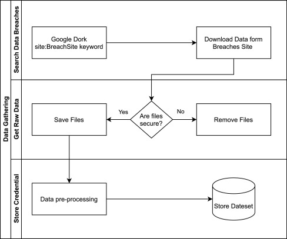

# AuthInfo-Dataset: Authentication Information Dataset

In this repository, you will find a Leaked User Authentication Information Dataset. It contains username (hashed), password pairs, and other features for analysis and visualizations. We use AuthInfo-Dataset for user password selection behaviors.

## AuthInfo-Dataset Source

AuthInfo-Dataset creates from eight different data sources that leaked from online services. Dataset data collection phase is shown in **Figure 1**. Please review the article for details. 
[https://doi.org/10.1016/j.cose.2021.102560](https://doi.org/10.1016/j.cose.2021.102560)

*Figure 1. Data Gathering Work Flow*

## AuthInfo-Dataset Feature

AuthInfo Dataset properties are extracted from username and password pairs. These features are seen in **Table 1**.

*Tabel.1 AuthInfo-Dataset Features*

| **Feature **		| **Explanation**						| **Sample**			|
|-------------------|---------------------------------------|-----------------------|
| AnonId			| Username hashed with salt				| 7CA2871... CD22FD40 	|
| Password			| Password								| Try34 				|
| Length			| Number of password’s character 		| 6 					|
| Type of Char		| Types of characters in the password 	| dlsu 					|
| Source			| Data source alias 					| 1. Data Source 		|
| Mask				| The mask obtained by replacing each character in the password with the character type sign																		| ulldds 	|
| Type of First Char 		| Password start character type 				| u 		|
| Type of End Char 			| Password last character type 					| s 		|
| Number of Lower Case 		| Number of lowercase letters in the password 	| 2			|
| Number of Upper Case 		| Number of capital letters in the password 	| 1			|
| Number of Special Char 	| Number of special characters in the password 	| 1			|
| Number of Decimal 		| Number of digits in the password 				| 2			|

## Full Dataset

The full datasets used in our paper can be found by following this [Google Drive Access Link](https://drive.google.com/drive/folders/1q5GaE8BCn3olqP1yhnM8wAxD_fIz0XoD?usp=sharing)

# A Novel Password Policy Focusing on Altering User Password Selection Habits: A Statistical Analysis on Breached Data

by Ebu Yusuf GÜVEN, Ali BOYACI, Muhammed Ali AYDIN

## Abstract

> Online services generally employ password-based systems to enable users to access personal/private content. These services also force their users to change their passwords periodically under specific policies to increase security. However, analysis of breached data reveals that current policies do not consider user password selection habits and pose critical security and privacy concerns. Additionally, when passwords are leaked, attackers have the opportunity to study - and possibly identify - the structure or pattern of the user password selection set. This way, attackers could predict the next password or reduce the search space considerably in their attacks. Therefore, this study proposes a novel behavior-based password policy to increase the present security level and avoid further exploitations if a breach occurs. This study uses statistical methods and visualization techniques to examine the password selection behaviors of over ten million UserID-password pairs collected from anonymously shared data breaches. The data set is anonymized while keeping the uniqueness of userID-password pairs and shared with other researchers along with extracted features. Results show that user password selection patterns can be generalized and used to increase the success rate of attacks.

## Citations

If you use the dataset, please cite the following paper:

``
	@article{GUVEN2022102560,
	title = {A Novel Password Policy Focusing on Altering User Password Selection Habits: A Statistical Analysis on Breached Data},
	journal = {Computers & Security},
	volume = {113},
	pages = {102560},
	year = {2022},
	issn = {0167-4048},
	doi = {https://doi.org/10.1016/j.cose.2021.102560},
	url = {https://www.sciencedirect.com/science/article/pii/S0167404821003849},
	author = {Ebu Yusuf Güven and Ali Boyaci and Muhammed Ali Aydin}
	}
``

> GÜVEN, Ebu Yusuf; BOYACI, Ali; AYDIN, Muhammed Ali. A Novel Password Policy Focusing on Altering User Password Selection Habits: A Statistical Analysis on Breached Data. Computers & Security, 2022, 113: 102560.
